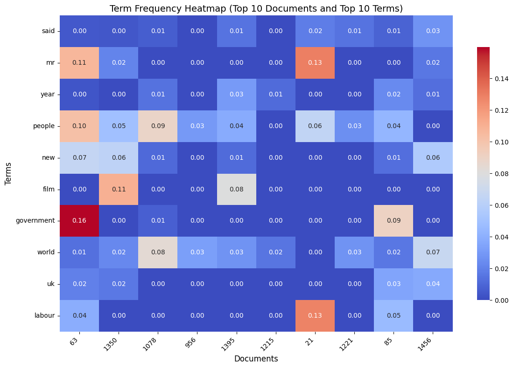
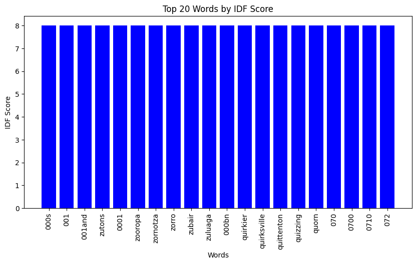

# 📄 TF-IDF Document Retrieval System

Welcome to the **TF-IDF Document Retrieval System**! This project is a Python-based implementation of a document retrieval system using the **Term Frequency-Inverse Document Frequency (TF-IDF)** algorithm. It allows users to search for the most relevant documents in a dataset based on a query.

---

## 🌟 Features

- **TF-IDF Vectorization**: Efficiently transforms text data into numerical vectors for document retrieval.
- **Interactive Search**: A user-friendly interface to input queries and retrieve the top 3 most relevant documents.
- **Visualizations**:
  - Word Cloud: Visual representation of the most frequent terms in the dataset.
  - Term Frequency Heatmap: Displays the TF-IDF scores for the top terms and documents.
  - TF-IDF Score Distribution: Histogram showing the distribution of TF-IDF scores.
- **Evaluation Metrics**: Displays cosine similarity scores for retrieved documents.
- **Simple UI**: Built using `ipywidgets` for an interactive experience in Jupyter Notebook.

---

## 🚀 Quick Start

### Prerequisites
- Python 3.8+
- Jupyter Notebook (for interactive usage)
- Required Python libraries: `pandas`, `numpy`, `scikit-learn`, `matplotlib`, `seaborn`, `wordcloud`, `ipywidgets`

### Installation
1. Clone the repository:
   ```bash
   git clone https://github.com/Birkity/tfidf-document-retrieval.git
   cd tfidf-document-retrieval
   ```
2. Install the required libraries:
   ```bash
   pip install -r requirements.txt
   ```
3. Open the Jupyter Notebook:
   ```bash
   jupyter notebook TF-IDF.ipynb
   ```

---

## 🖥️ Usage

1. **Load Your Dataset**:
   - Replace `'df_file.csv'` in the notebook with the path to your dataset.
   - Ensure the dataset has a column named `'Text'` containing the documents.

2. **Run the Notebook**:
   - Execute each cell in the notebook to preprocess the data, generate visualizations, and set up the search functionality.

3. **Interactive Search**:
   - Enter your query in the input box and click "Search".
   - The system will display the top 3 most relevant documents along with their cosine similarity scores.

---

## 📊 Visualizations

### Word Cloud


### Term Frequency Heatmap


### TF-IDF Score Distribution


---

## 🛠️ Code Structure

```
tfidf-document-retrieval/
├── TF-IDF.ipynb  # Main Jupyter Notebook
├── requirements.txt                # List of dependencies
├── your_dataset.csv                # Example dataset (replace with your data)
├── README.md                       # Project documentation
└── images/                         # Folder for storing visualizations
```

---

## 🤝 Contributing

Contributions are welcome! If you'd like to contribute, please follow these steps:
1. Fork the repository.
2. Create a new branch (`git checkout -b feature/YourFeatureName`).
3. Commit your changes (`git commit -m 'Add some feature'`).
4. Push to the branch (`git push origin feature/YourFeatureName`).
5. Open a pull request.

---

## 📄 License

This project is licensed under the MIT License. See the [LICENSE](LICENSE) file for details.

---

## 🙏 Acknowledgments

- Thanks to the creators of `scikit-learn`, `matplotlib`, and `ipywidgets` for their amazing libraries.
- Inspired by the need for efficient document retrieval systems in natural language processing (NLP).

---

## 📧 Contact

For questions or feedback, feel free to reach out:

- **Birkity Yishak**  
- **Email**: birkity.yishak.m@gmail.com  
- **GitHub**: [your-username](https://github.com/Birkity)    

---

Made with ❤️ by **Birkity**  
✨ Happy Coding! ✨

---
